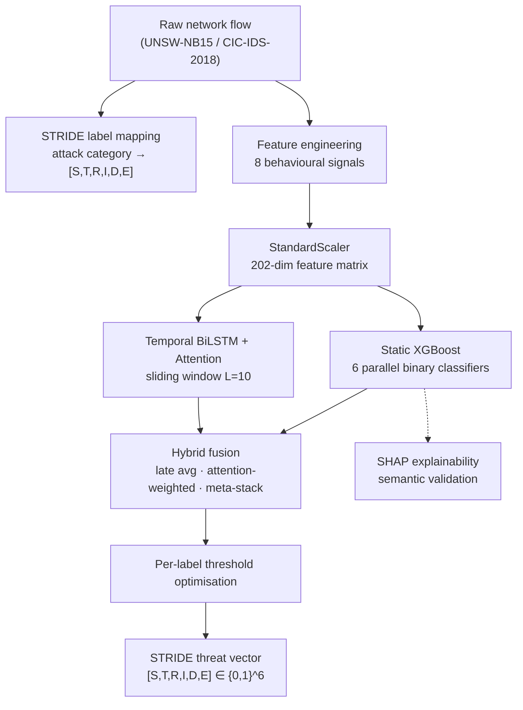

# Adaptive STRIDE-based Multi-Label Intrusion Detection

### AI-Augmented Behavioural Modelling for Network Threat Detection

[](https://www.python.org/)
[](https://xgboost.readthedocs.io/)
[](https://www.tensorflow.org/)
[](https://github.com/shap/shap)
[](LICENSE)
[](#-datasets)

> **Bachelor of Engineering (Honours) Thesis — UNSW Sydney**
> Author: **Netik Kumar Maheshwari** · Supervisor: **A/Prof. Jiaojiao Jiang**
> School of Computer Science and Engineering · 2026

📄 **[Read the full thesis (PDF)](docs/Thesis_Report.pdf)** · 📓 **[Run the notebook](notebooks/stride_multilabel_ids.ipynb)**

---

## Overview

Most intrusion detection systems (IDS) answer a single question — *“is this traffic an attack?”* — or, at best, assign **one** attack label per network flow. But real attacks are rarely one-dimensional. A **backdoor** intrusion, for example, simultaneously involves **Spoofing** (false credentials), **Repudiation** (hidden activity), and **Elevation of Privilege** (unauthorised access). Forcing it into a single label discards most of the story.

This project reformulates intrusion detection as a **structured multi-label prediction problem** aligned with the **STRIDE** threat model:

```
           single-label IDS                 this work
   f(x) ──▶ "Backdoor"          f(x) ──▶ [ S, T, R, I, D, E ]
                                          │  │  │  │  │  └─ Elevation of Privilege
                                          │  │  │  │  └──── Denial of Service
                                          │  │  │  └─────── Information Disclosure
                                          │  │  └────────── Repudiation
                                          │  └───────────── Tampering
                                          └──────────────── Spoofing
```

Every network flow receives an **independent probability across all six STRIDE dimensions simultaneously** — turning a category name into an actionable threat profile for a security operations team.

To the best of our knowledge, this is the **first work to use STRIDE as a real-time machine-learning prediction target** rather than a design-time labelling tool.

---

## Key Results

The **identical pipeline** — same architecture, same hyperparameters, no retuning — is evaluated on two independent benchmarks.

| Metric | UNSW-NB15 | CIC-IDS-2018 |
|---|---|---|
| **Macro AUROC** | **0.9556 ± 0.0006** | **0.9893** |
| **Macro F1** | 0.6869 | 0.7896 |
| **Micro F1** | 0.7864 | 0.8579 |
| **Hamming Loss** | 0.0750 | 0.0358 |
| **McNemar _p_-value** | < 0.0001 | < 0.0001 |

- 📈 **+0.2761 Macro F1** over the single-label XGBoost baseline (0.4074 → 0.6869).
- ✅ **Statistically significant** improvement across **all six** STRIDE dimensions (McNemar's test, _p_ < 0.0001).
- 🔁 **Cross-dataset generalisation:** performance *improves* on the second dataset — ruling out dataset memorisation.
- ⚡ **Real-time ready:** XGBoost inference < 1 ms/flow, BiLSTM < 5 ms/flow.

<p align="center">
  
  <br>
  <em>Per-STRIDE ROC curves on UNSW-NB15 — mean AUROC 0.9558. Every dimension clears 0.92 AUROC.</em>
</p>

> See [`docs/results.md`](docs/results.md) for the complete per-dimension, ablation, cross-validation, and statistical-test tables — with all figures.

---

## Architecture



**Two complementary base models:**

- **Static XGBoost** — six independent gradient-boosted classifiers (one per STRIDE dimension), excellent at non-linear tabular feature interactions and natively SHAP-compatible.
- **Temporal Bidirectional LSTM + soft attention** — models sequences of consecutive flows (window `L = 10`), capturing the temporal progression of an attack (reconnaissance → exploitation → lateral movement).

The two are combined through three **fusion strategies** (late averaging, attention-weighted averaging, meta-stack logistic regression), then refined with **per-label threshold optimisation**. Full details in [`docs/architecture.md`](docs/architecture.md).

---

## STRIDE-Aligned Behavioural Features

Eight security-theoretic signals encode domain knowledge directly into the feature space. Each is validated by **both** an ablation study **and** SHAP analysis.

| Signal | Targets | Intuition |
|---|:---:|---|
| `feat_resource_exhaustion` | **D** | Load + packet rate per second — DoS flooding |
| `feat_conn_burst_rate` | **D, S** | Connections per second — scanning / flooding |
| `feat_asymmetry_ratio` | **I, R** | Byte asymmetry — covert / exfiltration channels |
| `feat_session_entropy` | **T** | Timing + payload irregularity — fuzzing |
| `feat_privesc_score` | **E** | FTP abuse + transaction depth — privilege escalation |
| `feat_stealth_probe` | **S, I** | TTL manipulation — reconnaissance |
| `feat_payload_anomaly` | **T, E** | Large payload / few packets — exploit delivery |
| `feat_repudiation_risk` | **R** | FTP commands + covert load — unattributable activity |

> Formulas, security rationale, and validation evidence: [`docs/feature-engineering.md`](docs/feature-engineering.md).

---

## Explainability (SHAP)

SHAP is used not just for feature importance, but for **semantic validation** — confirming the model learns the *right patterns for the right reasons*:

- 🌐 **`sttl` (source TTL)** emerges as a **universal cross-threat indicator** across five of six dimensions — the model discovered this from data, and it matches independent prior findings.
- 🎯 **`feat_asymmetry_ratio`** ranks as the **#1 predictor of Repudiation** — exactly the dimension it was engineered to capture.
- 🚨 **`service_dns`** is the strongest **Denial of Service** signal, reflecting DNS amplification.

<p align="center">
  
  <br>
  <em>Mean |SHAP| per feature across all six STRIDE dimensions (★ = engineered behavioural signal).</em>
</p>

---

## Datasets

| Property | UNSW-NB15 | CIC-IDS-2018 |
|---|---|---|
| Flows evaluated | 257,673 | 500,000 (stratified sample) |
| Attack categories | 9 | 12 |
| Final feature dimensionality | 202 | 202 |

The datasets are **not** included in this repository (licensing + size). Download them from the official sources:

- **UNSW-NB15** — [UNSW Canberra / Moustafa & Slay](https://research.unsw.edu.au/projects/unsw-nb15-dataset)
- **CIC-IDS-2018** — [Canadian Institute for Cybersecurity](https://www.unb.ca/cic/datasets/ids-2018.html)

---

## Repository Structure

```
.
├── notebooks/
│   └── stride_multilabel_ids.ipynb   # End-to-end pipeline (data → models → SHAP → stats)
├── docs/
│   ├── Thesis_Report.pdf             # Full honours thesis
│   ├── architecture.md               # Model architecture & fusion strategies
│   ├── feature-engineering.md        # The 8 behavioural signals (formulas + rationale)
│   ├── results.md                    # Full results, ablations & statistical validation
│   └── figures/                      # Result figures (ROC, confusion matrices, SHAP, PR)
├── requirements.txt
├── CITATION.cff
├── LICENSE
└── README.md
```

---

## Quick Start

```bash
# 1. Clone
git clone https://github.com/netik05/AI-augmented-multi-label-intrusion-detection-using-STRIDE-threat-framework-.git
cd AI-augmented-multi-label-intrusion-detection-using-STRIDE-threat-framework-

# 2. Environment (Python 3.11 recommended)
python -m venv .venv && source .venv/bin/activate
pip install -r requirements.txt

# 3. Download UNSW-NB15 / CIC-IDS-2018 CSVs (see Datasets above) into a local ./data folder

# 4. Launch the notebook
jupyter lab notebooks/stride_multilabel_ids.ipynb
```

> The notebook was developed on the **Kaggle GPU environment** (NVIDIA Tesla P100). A GPU is recommended for the BiLSTM stage but not required for XGBoost.

---

## Pipeline Summary

| Stage | Component | Configuration |
|---|---|---|
| Pre-processing | STRIDE mapping | 10 attack categories → 6-dim binary vector |
| Feature engineering | 8 behavioural signals | appended to 37 numeric + 157 one-hot = **202 features** |
| Static model | XGBoost ×6 | 300 trees, depth 6, `hist`, ~84 s train |
| Temporal model | BiLSTM + attention | 128+64 units, window `L=10`, ~20 min train |
| Fusion | 3 strategies | late avg · attention-weighted · meta-stack |
| Post-processing | Threshold optimisation | grid search `τ ∈ [0.10, 0.85]` per dimension |
| Validation | 5-fold CV · McNemar · SHAP | `StratifiedKFold`, `random_state=42` |

---

## Citation

If you use this work, please cite:

```bibtex
@thesis{maheshwari2026stride,
  title  = {Adaptive STRIDE-based Multi-Label Intrusion Detection using AI-Augmented Behavioural Modelling},
  author = {Maheshwari, Netik Kumar},
  school = {University of New South Wales (UNSW Sydney)},
  type   = {Bachelor of Engineering (Honours) Thesis},
  year   = {2026}
}
```

Machine-readable metadata is provided in [`CITATION.cff`](CITATION.cff).

---

## Acknowledgements

This research builds on publicly available datasets and open-source tooling. Thanks to **Nour Moustafa and Jill Slay** (UNSW-NB15), the **Canadian Institute for Cybersecurity** (CIC-IDS-2018), and the maintainers of **XGBoost, TensorFlow, scikit-learn, and SHAP**. Experiments were run on the UNSW-provided Kaggle GPU environment.

## License

Released under the [MIT License](LICENSE).
