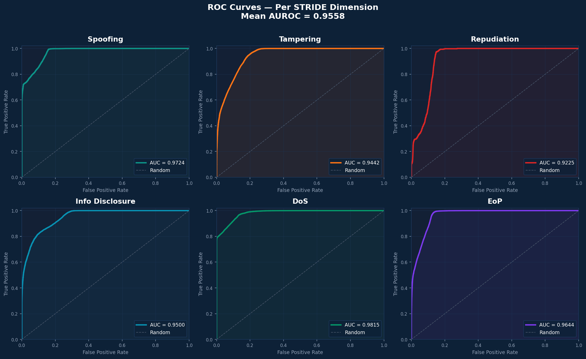
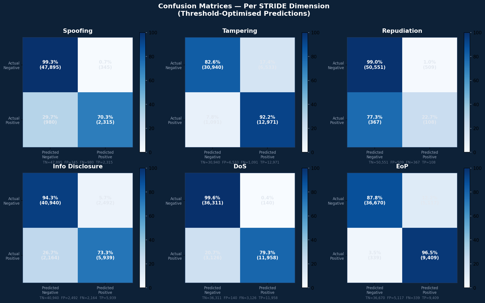
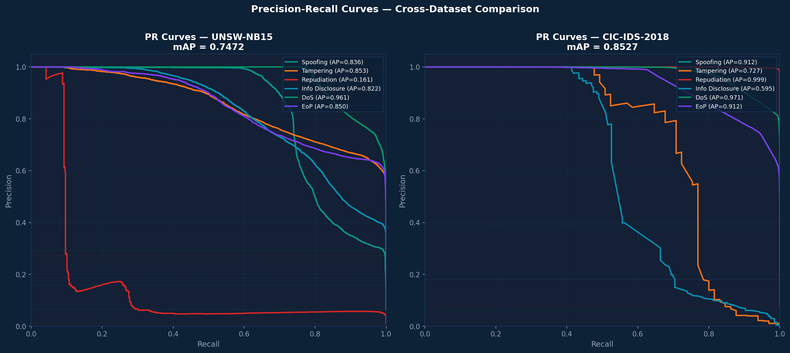
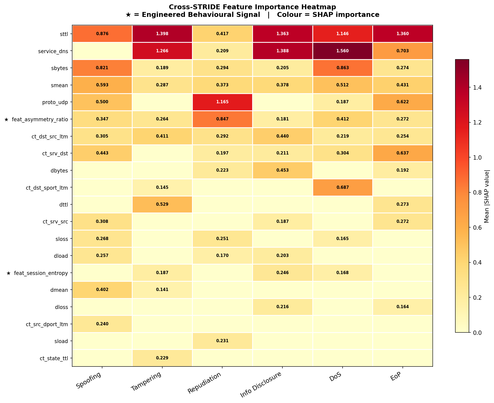
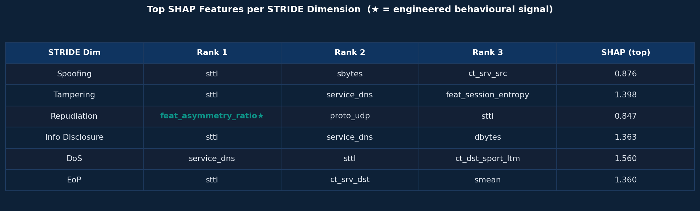
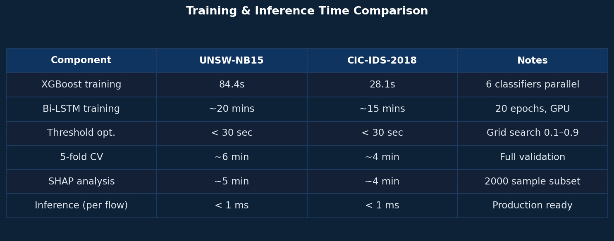

# Experiments & Results

All experiments ran on the Kaggle GPU environment (NVIDIA Tesla P100, 16 GB) with Python 3.11, XGBoost 2.0, TensorFlow 2.13, scikit-learn 1.3. Results are on a held-out 20% stratified test split (scaler fit on train only). Five-fold CV uses `StratifiedKFold(random_state=42)`.

**Metrics.** Macro AUROC (ranking, threshold-independent) · Macro F1 (primary — equal weight to all six dimensions) · Micro F1 (frequency-weighted) · Hamming Loss (label-level error rate).

---

## 1. Baselines

| Model | Accuracy | Precision | Recall | F1 |
|---|---|---|---|---|
| **Binary** — Random Forest | 0.8705 | 0.89 | 0.86 | 0.86 |
| **Binary** — XGBoost | 0.8754 | 0.90 | 0.86 | 0.87 |
| **Single-label STRIDE** — Random Forest | 0.7573 | 0.60 | 0.55 | 0.53 |
| **Single-label STRIDE** — XGBoost | 0.7710 | 0.62 | 0.57 | 0.55 |
| **Single-label STRIDE** — LightGBM | 0.7700 | 0.61 | 0.57 | 0.55 |
| **Single-label STRIDE** — MLP | 0.7625 | 0.60 | 0.54 | 0.51 |

---

## 2. Multi-Label Framework Ablation (UNSW-NB15)

| Configuration | Macro F1 | Micro F1 | Hamming | AUROC |
|---|---|---|---|---|
| Single-label XGBoost (baseline) | 0.4074 | — | — | — |
| Static XGBoost (multi-label) | 0.6592 | 0.7647 | 0.0707 | 0.9550 |
| Temporal BiLSTM (multi-label) | 0.5725 | 0.7089 | 0.0869 | 0.9406 |
| Fusion: Late Averaging | 0.6293 | 0.7499 | 0.0744 | 0.9520 |
| Fusion: Attention-Weighted | 0.6162 | 0.7477 | 0.0750 | 0.9522 |
| Fusion: Meta-Stack | 0.6519 | 0.7573 | 0.0723 | 0.9454 |
| XGBoost + Threshold Opt. | 0.6869 | 0.7864 | 0.0750 | 0.9558 |
| **Full Pipeline (best)** | **0.6869** | **0.7864** | **0.0723** | **0.9558** |

**Key finding:** the multi-label reformulation alone contributes +0.2518 Macro F1 over the single-label baseline — the single largest driver of improvement.

---

## 3. Per-STRIDE Dimension (Full Pipeline, UNSW-NB15)

| Dimension | AUROC | F1 (default) | F1 (optimised) |
|---|---|---|---|
| Spoofing (S) | 0.9724 | 0.7836 | 0.7775 |
| Tampering (T) | 0.9442 | 0.7367 | 0.7729 |
| Repudiation (R) | 0.9225 | 0.1583 | 0.1978 |
| Info Disclosure (I) | 0.9500 | 0.6945 | 0.7184 |
| Denial of Service (D) | 0.9815 | 0.8761 | 0.8798 |
| Elev. of Privilege (E) | 0.9644 | 0.7063 | 0.7752 |
| **Mean** | **0.9558** | **0.6593** | **0.6869** |

  
   <em>ROC curves per STRIDE dimension (UNSW-NB15) — mean AUROC 0.9558.</em>

  
   <em>Threshold-optimised confusion matrices per dimension (percentages with raw counts).</em>

---

## 4. Cross-Dataset Generalisation (UNSW-NB15 vs CIC-IDS-2018)

The **identical** pipeline — no retuning — applied to a 500,000-flow CIC-IDS-2018 sample.

| Metric | UNSW-NB15 | CIC-IDS-2018 |
|---|---|---|
| Macro F1 | 0.6869 | 0.7896 |
| Micro F1 | 0.7864 | 0.8579 |
| Hamming Loss | 0.0750 | 0.0358 |
| Macro AUROC | 0.9558 | 0.9893 |

**Per-STRIDE AUROC:**

| Dimension | UNSW-NB15 | CIC-IDS-2018 |
|---|---|---|
| Spoofing (S) | 0.9724 | 0.9834 |
| Tampering (T) | 0.9442 | 0.9959 |
| Repudiation (R) | 0.9225 | 0.9999 |
| Info Disclosure (I) | 0.9500 | 0.9885 |
| Denial of Service (D) | 0.9815 | 0.9849 |
| Elev. of Privilege (E) | 0.9644 | 0.9834 |
| **Mean** | **0.9558** | **0.9893** |

Performance *improves* on the second dataset across all four metrics, ruling out dataset memorisation. Repudiation reaches AUROC 0.9999 on CIC-IDS-2018, where the Bot category supplies 40,455 positive samples vs UNSW-NB15's 2,329 Backdoor samples.

  
   <em>Precision–recall curves per STRIDE dimension — UNSW-NB15 (left) vs CIC-IDS-2018 (right).</em>

---

## 5. Ablation Studies

**Feature engineering (with vs without the 8 behavioural signals):**

| Configuration | Macro F1 | Micro F1 | Hamming | AUROC |
|---|---|---|---|---|
| Without behavioural signals | 0.6562 | 0.7642 | 0.0709 | 0.9548 |
| With behavioural signals | 0.6869 | 0.7864 | 0.0750 | 0.9558 |
| **Gain** | **+0.0307** | +0.0222 | — | +0.0010 |

Largest per-dimension drops when removed: EoP (−0.0698), Repudiation (−0.0538) — matching design intent.

**Attention mechanism** (50k-sample subset, `L=5`): marginal effect (ΔMacro F1 = −0.0095, ΔAUROC = +0.0003). Retained for interpretability; benefits are most apparent on longer sequences / larger training sets.

---

## 6. Statistical Validation

**Five-fold stratified cross-validation (UNSW-NB15, N = 257,673):**

| Metric | Mean | Std | Min | Max |
|---|---|---|---|---|
| Macro F1 | 0.6595 | 0.0045 | 0.6522 | 0.6655 |
| Micro F1 | 0.7647 | 0.0017 | 0.7629 | 0.7669 |
| Hamming Loss | 0.0705 | 0.0003 | 0.0701 | 0.0709 |
| Macro AUROC | 0.9556 | 0.0006 | 0.9547 | 0.9562 |

Extremely low variance (AUROC std 0.0006) indicates the model is invariant to data partition — a hallmark of good generalisation.

**McNemar's test — multi-label vs single-label baseline:**

| Dimension | Our F1 | Baseline F1 | _p_-value | Significant? |
|---|---|---|---|---|
| Spoofing (S) | 0.7865 | 0.7886 | 0.0020 | ✅ |
| Tampering (T) | 0.7706 | 0.7694 | < 0.0001 | ✅ |
| Repudiation (R) | 0.1838 | 0.0000 | < 0.0001 | ✅ |
| Info Disclosure (I) | 0.7168 | 0.0114 | < 0.0001 | ✅ |
| DoS (D) | 0.8760 | 0.8747 | 0.0240 | ✅ |
| EoP (E) | 0.7667 | 0.0000 | < 0.0001 | ✅ |
| **Overall** | **0.6834** | **0.4074** | **< 0.0001** | ✅ |

For Repudiation, Information Disclosure, and EoP the single-label baseline scores **0.0000** — it structurally cannot activate these dimensions. For three of six dimensions, multi-label prediction is the difference between detecting a threat and missing it entirely.

---

## 7. SHAP Explainability

**Top feature per STRIDE dimension:**

| Dimension | Top Feature | Mean \|SHAP\| | Meaning |
|---|---|---|---|
| Spoofing (S) | `sttl` | 0.876 | TTL manipulation |
| Tampering (T) | `sttl` | 1.398 | TTL in tampered flows |
| Repudiation (R) | `feat_asymmetry_ratio` ⭐ | 0.847 | Covert-channel asymmetry |
| Info Disclosure (I) | `sttl` | 1.363 | TTL in exfiltration flows |
| DoS (D) | `service_dns` | 1.560 | DNS amplification |
| EoP (E) | `sttl` | 1.360 | TTL in escalation flows |

⭐ = engineered behavioural signal.

- **`sttl`** dominates five of six dimensions — a universal, data-discovered threat indicator consistent with prior literature.
- **`feat_asymmetry_ratio`** is the #1 Repudiation predictor — the dimension it was engineered for.
- **`proto_udp`** (SHAP 1.165) is a strong Repudiation indicator — UDP leaves minimal audit trail.

  
   <em>Mean |SHAP| per feature across all six dimensions (★ = engineered behavioural signal).</em>

  
   <em>Top-ranked features per STRIDE dimension by mean |SHAP|.</em>

---

## 8. Computational Performance

| Component | UNSW-NB15 | CIC-IDS-2018 | Inference |
|---|---|---|---|
| XGBoost (×6) | 84 s | 28 s | < 1 ms/flow |
| BiLSTM + Attention | ~20 min | ~15 min | < 5 ms/flow |
| Threshold optimisation | 30 s | 30 s | — |
| 5-fold CV | ~6 min | ~4 min | — |
| SHAP analysis | ~5 min | ~4 min | — |

  
   <em>Training and inference times across both datasets.</em>

---

## 9. UNSW-NB15 Class Distribution & STRIDE Mapping

| Category | Count | % | STRIDE Vector [S, T, R, I, D, E] |
|---|---|---|---|
| Normal | 93,000 | 36.1% | [0, 0, 0, 0, 0, 0] |
| Generic | 40,000 | 15.5% | [0, 0, 0, 0, 1, 0] |
| Exploits | 33,393 | 13.0% | [0, 1, 0, 0, 0, 1] |
| Fuzzers | 18,184 | 7.1% | [0, 1, 0, 1, 0, 0] |
| DoS | 12,264 | 4.8% | [0, 0, 0, 0, 1, 0] |
| Reconnaissance | 10,491 | 4.1% | [1, 0, 0, 1, 0, 0] |
| Analysis | 2,677 | 1.0% | [0, 0, 0, 1, 0, 0] |
| Backdoor | 2,329 | 0.9% | [1, 0, 1, 0, 0, 1] |
| Shellcode | 1,511 | 0.6% | [0, 1, 0, 0, 0, 1] |
| Worms | 174 | 0.1% | [0, 1, 0, 0, 1, 0] |
| **Total** | **257,673** | **100%** | |

---

## Primary Limitation

Repudiation F1 remains low (0.1978 after threshold optimisation) due to severe class imbalance (~476 positive training samples, ~1:433 ratio). However, Repudiation AUROC of 0.9225 shows strong *ranking* ability — the challenge is **calibration**, not discrimination. Future work: focal loss, SMOTE, and generative traffic augmentation.
